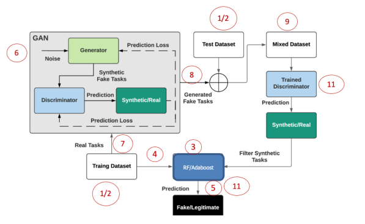
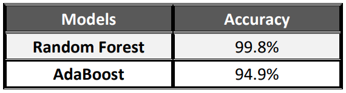
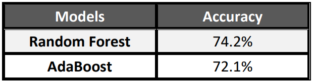
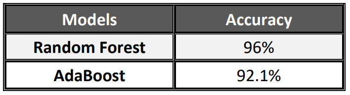
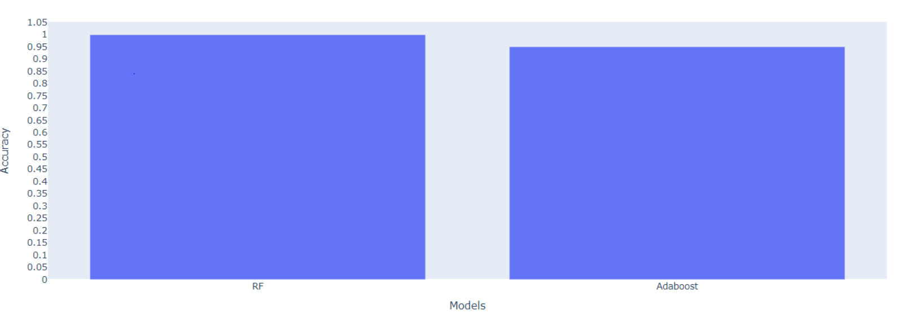
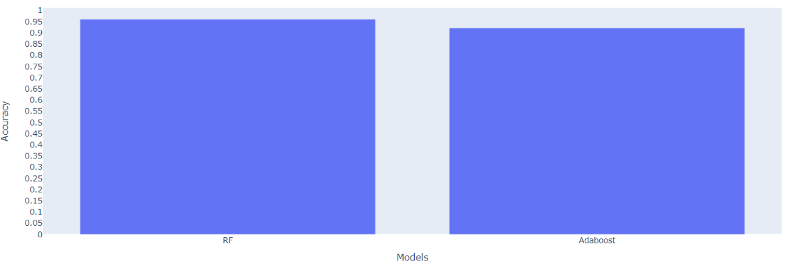

# Generating Fake Tasks using GANs

This project explains how to use GANs with tabular data not only with images

# Table of Contents

[Objective](#1)

[Team Members](#2)

[Overview](#3)

[The Project Methodology](#4)

[Dataset Source](#5)

[Project Steps](#6)

[Results](#7)

[Conclusion](#8)

[References](#9)

# <a name = "1">Objective</a>

The project was part of our AI & Data Science Master's degree at the University of Ottawa. 

Kaggle link: [Link](https://www.kaggle.com/code/mostafanofal/network-intrusion-detection-hyperparameter-tuning)

Check all the projects here: [Link](https://github.com/Mostafanofal453)

# <a name = "2">Team Members </a>

[Nada Abdellatef](https://www.linkedin.com/in/nada-abdellatef-846547181/)

[Hadeer Mamdooh](https://www.linkedin.com/in/hadeer-mamdooh-204522171/)

[Mostafa Nofal](https://www.linkedin.com/in/mostafa-nofal-772625194/)

# <a name = "3">Overview</a>
Fake task attack is critical for Mobile Crowdsensing system (MCS) that aim to clog the sensing servers in the MCS platform and drain more energy from participants’ smart devices. Typically, fake tasks are created by empirical model such as CrowdSenSim tool. Recently, cyber criminals deploy more intelligent mechanisms to create attacks. Generative Adversarial Network (GAN) is one of the most powerful techniques to generate synthetic samples. GAN considers the entire data in the training dataset to create similar samples. This project aims to use GAN to create fake tasks and verify fake task detection performance. 

# <a name = "4">The Project Methodology</a>

The objective of this project is to generate intelligent fake tasks by GAN. Meanwhile, we need to evaluate detection accuracy for original fake tasks and GAN-generated fake tasks. Detection mechanisms contains classic machine learning (ML) models (e.g., Random Forest (RF) and Adaboost) and a GAN-based cascade detection framework. Another objective is to compare traditional MLs and the cascade detection framework detection performance. 

[//]: # (![image]&#40;https://drive.google.com/uc?export=view&id=1wYDWb0SRVkAllKcajembQtB4ywvVX3R0;)

# <a name = "5">Dataset Source</a>

Download MCS dataset via this [Link](http://nextconlab.academy/MCSData/MCS-FakeTaskDetection.html) 

# <a name = "6">Project Steps:</a>

1. Split the dataset into training dataset (80%) and test dataset (20%) 
2. Implement classic classifiers (Adaboost and RF) 
3. Train Adaboost and RF via training dataset 
4. Verify detection performance using test dataset and present results comparison in bar chart 
5. Implement a GAN model
6. Apply the provided training dataset to GAN 
7. Generate synthetic fake tasks via Generator network in GAN after the training procedure 
8. Mix the generated fake tasks with the original test dataset to obtain a new test dataset 
9. Obtain Adaboost and RF detection performance using the new test dataset and present results in bar chart (This step doesn’t consider Discriminator for filtering synthetic samples)
10. Show results considering the Discriminator to as the first level classifier and RF/Adaboost as the second level classifier

# <a name = "7">Results</a>

|            | Original test set                   | Mixed without discriminator          | Cascade framework                   |
| ---------- | ----------------------------------- | ------------------------------------ | ----------------------------------- |
| Accuracies |  |   |  |
| Bar Chart  |  |  |  |

[//]: # (| ![image]&#40;https://drive.google.com/uc?export=view&id=1EUZABxhwsYhC7RAIAA8MogDVgnqgWlD0;                                                                                                                  | ![image]&#40;https://drive.google.com/uc?export=view&id=1r3x_j3zuukV1CtcKmzDwqLWPm9f8RjIE;                                                                                                                              | ![image]&#40;https://drive.google.com/uc?export=view&id=1tyXF3O4owtCo8aheUuOUjNokEn9P9-21;                                                                                                                           | ![image]&amp;#40;https://drive.google.com/uc?export=view&id=1Y1haFnq7q2KV83WcbxyZlPx7TXOZgZvN;                                                                                                              | ![image]&amp;#40;https://drive.google.com/uc?export=view&id=1MegUWSZur2ofC3R7ZcZp4s3HTXfa90lR;                                                                                                                  | ![image]&amp;#40;https://drive.google.com/uc?export=view&id=1qNnosYT-ZPn7RAD44iIKn2pQykMzEOxN;                                                                                                             |))

# <a name = "8">Conclusion</a>

The generated tasks from the generator are robust and succeeded to fault the classic ML algorithms because it tried to generate tasks very close to the real one, so the models can’t determine it and the accuracies have been decreased from 0.92 to 0.575 in the Adaboost model and have been decreased from 0.993 to 0.590 in the Random Forest model. In the cascade approach, the discriminator helped the models because it can filter the fake tasks, so after filtering it out the accuracies increased again to 0.926 in Adaboost and to 0.993 in the Random Forest model and this result is approximately one before mixing which means that the discriminator filtered.

# **<a name = "9">References</a>**
1. GAN implementation via keras https://keras.io/examples/generative/conditional_gan/
2. GAN implementation via tensorflow https://www.tensorflow.org/tutorials/generative/dcgan
3. GAN tutorial https://towardsdatascience.com/generative-adversarial-network-gan-for-dummies-a-step-bystep-tutorial-fdefff170391
4. Chen, Zhiyan, and Burak Kantarci. "Generative Adversarial Network-Driven Detection of AdversarialTasks in Mobile Crowdsensing."arXiv preprint arXiv:2202.07802 (2022).
5. Mirza, Mehdi, and Simon Osindero. "Conditional generative adversarial nets." arXiv preprint arXiv:1411.1784 (2014).
